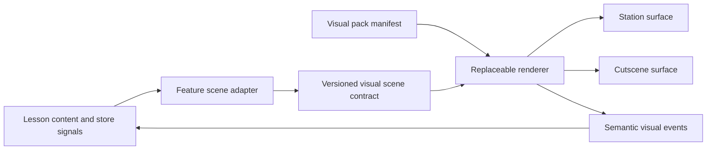

# Dragon Genetics visual laboratory plan

Use the [station simulation build guides](dragon-genetics-simulations/README.md) for the code-facing
specification of each independent display.

## Product decision

Build one continuous **Royal Dragon Genetics Laboratory** with ten stations, not ten unrelated pages. The laboratory shell stays familiar while the active instrument changes. Students should feel that they are carrying the same specimens, predictions, and evidence from the observation bay through the hatchery and finally into the arena.

Every science interaction follows the same evidence loop:

1. **Observe** a selected sample record, allele model, egg group, graph, or breeding pool.
2. **Predict or classify** before any important reveal.
3. **Manipulate** the model by moving evidence, changing alleles, selecting parents, or running a trial.
4. **Reveal** the modeled result with a short, purposeful transition.
5. **Explain** the result by selecting visual evidence and completing a claim or correction.
6. **Save** the prediction, model state, result, skill evidence, and misconception flag.

This loop is the visual contract for teaching, guided practice, mastery questions, reteach, official breeding, and the final evidence defense.

## Laboratory setting

The visual direction should combine a readable school science laboratory with the fantasy hatchery setting.

- **Room:** dark blue-gray laboratory walls, stone-and-metal hatchery architecture, labeled glass instruments, softly glowing specimen tanks, brass or amber safety accents, and restrained magical energy effects.
- **Center stage:** the active scientific instrument. It receives most of the screen area and shows only the model that instrument analyzes.
- **Left console:** mission, learning target, current skill, and the Observe/Predict/Reveal phase.
- **Right evidence dock:** the student's current prediction, selected evidence, notebook entry, and targeted feedback.
- **Bottom action rail:** one primary action such as Check prediction, Run trial, Reveal genotype, or Save evidence.
- **Continuity:** selected sample IDs, parent relationships, offspring records, allele identities, trial numbers, and saved evidence remain consistent as students move between stations.

### Sample selection and instrument separation

Students select a dragon, egg, offspring, parent pair, sibling group, or population in the laboratory sample console. That selection becomes a semantic analysis record containing IDs, relationships, genes, alleles, phenotype labels, and trial data.

Each station is a separate simulation. The station consumes the selected analysis record but does not render the selected dragon's body or parts. It renders only its scientific model: chromosomes and DNA, allele pairs, inheritance cells, egg outcomes, probability plots, parent-to-offspring allele paths, or diversity counts. A portrait may be used in the separate sample selector, and the assembled dragon appears in the final arena, but neither is embedded in the scientific instruments.

| Separate tool | Student data it can analyze | What the simulation displays |
| --- | --- | --- |
| Trait Evidence Analyzer | Selected characteristic records and student classifications | Evidence trays and inherited/learned/environmental source paths |
| Genome Microscope | Selected egg or dragon genome and focus gene | Cell, chromosome, DNA, gene location, and allele pair |
| Genotype Scanner | Selected sample, focus gene, genotype, and phenotype label | Shielded allele pair, genotype possibilities, and phenotype readout |
| Allele Workbench | Selected sample, working allele pair, and student prediction | Allele sockets, expression rule, carrier state, and predicted/actual readout |
| Punnett Composer | Two selected parent records and focus gene | Parent alleles, four inheritance cells, grouped genotypes, and phenotype probabilities |
| Incubator Sampler | Saved parent cross, predicted distribution, and egg results | Generic eggs, expected marker, observed counts, and aligned percentage plot |
| Reproduction Comparison | Selected source records and generated offspring records | Two-parent allele mixing beside one-parent genotype copying |
| Sibling Tracer | Saved parents and selected sibling records | Parent-to-offspring allele lanes and a sibling genotype matrix |
| Diversity Manager | Student breeding pool, retained samples, alleles, and genotypes | Population nodes, allele counts, genotype counts, diversity indicator, and narrowing warnings |
| Evidence Replay | Saved predictions, trials, selections, and results | Reconstructed scientific models and pinned evidence timeline |

The sample console passes only the records required by the active tool. A tool must not reach into the lesson store to discover additional data on its own.

Suggested station sequence:

```mermaid
flowchart LR
  A[1 Observation Bay] --> B[2 Genome Microscope]
  B --> C[3 Genotype Scanner]
  C --> D[4 Allele Workbench]
  D --> E[5 Breeding Console]
  E --> F[6 Incubator Trials]
  F --> G[7 Reproduction Chambers]
  G --> H[8 Sibling Scanner]
  H --> I[9 Population Lab]
  I --> J[10 Arena Airlock]
```



The setting should support immersion without hiding the science. Instruments, labels, and evidence marks must remain clearer than decorative scenery.

Desktop station layout:

```text
+--------------------------------------------------------------------------------+
| Royal Dragon Genetics Laboratory | Week / Station | Learn / Practice / Official |
+-------------------+------------------------------------------+-----------------+
| Mission console   |                                          | Evidence dock   |
| learning target   |       active laboratory instrument       | prediction      |
| skill and phase   |       instrument model or trial           | selected proof  |
| station map       |                                          | feedback        |
+-------------------+------------------------------------------+-----------------+
| Previous station       | Check / Run / Reveal / Save evidence | Next station   |
+--------------------------------------------------------------------------------+
```

On a narrow screen, the mission console becomes a compact station header and the evidence dock moves directly below the active instrument.

## Three modes using the same simulations

| Mode | Visual behavior | Feedback and logging |
| --- | --- | --- |
| Learn | Labels, guided focus, worked example, optional hint, and visible phase prompts | Immediate feedback names the rule and points to the exact visual evidence |
| Practice | New dragons and allele combinations, optional hints, student-controlled trials | Saves prediction, manipulation path, result, corrections, and misconception flags |
| Official | Same instruments with hints and premature reveals disabled; seeded equal conditions | Saves the locked prediction, complete trial state, result, evidence response, and score components |

Reteach reuses the same station in Learn mode with one misconception-focused example, three to five new visual practice items, a correction prompt, and a new assessment scene.

## Reusable visual simulation primitives

These ten primitives cover the whole unit. They are separate simulations parameterized with selected analysis samples, gene definitions, alleles, relationships, trial seeds, and question text rather than copied per module.

| ID | Primitive | What students see and do | Reused for |
| --- | --- | --- | --- |
| V1 | Trait evidence analyzer | The selected sample's observation record contains inherited features, learned behaviors, and environmental effects. Students inspect evidence readouts and place each observation in the correct tray without using body-part artwork. | GEN-1 teaching, diagnostic, mastery, license, and reteach |
| V2 | Genome microscope | A selected sample tube or egg record opens into a cell model, chromosome pair, DNA strand, gene location, and allele pair. Students place labels and answer questions by selecting a level in the nested information model. | GEN-2 teaching, matching, diagram interpretation, mastery, and license |
| V3 | Genotype scanner | The instrument shows a phenotype readout while shielding the selected sample's allele pair. Students select supported genotypes, scan, and compare sample readouts without rendering either dragon. | GEN-3 teaching, multi-select, mastery, and evidence defense |
| V4 | Allele switchboard | Two allele sockets control one phenotype readout. Students predict, replace one token, and energize the analyzer. Both alleles remain visible so a carried recessive allele never appears to disappear. | GEN-4 teaching, misconception correction, mastery, and reteach |
| V5 | Punnett composer | Students drag one allele from each parent into four offspring cells, group identical genotypes, convert them to phenotypes, and enter probabilities before Breed unlocks. | GEN-5 teaching, practice, official breeding, mastery, and license |
| V6 | Incubator sampling bench | Expected probability appears as a reference marker. Eggs hatch into small and large trays while observed counts and percentages update on the same aligned plot. | Probability versus observed results, sample-size questions, and GEN-5/GEN-7 evidence |
| V7 | Split reproduction chamber | A two-parent chamber shows allele mixing beside a one-parent clone-style chamber. Students run both and identify which offspring wall shows more modeled combinations. | GEN-6 teaching, comparison questions, mastery, and license |
| V8 | Sibling inheritance tracer | Parent allele lanes flow into selectable siblings. Selecting two hatchlings highlights the exact source allele paths and the phenotype differences they produced. | GEN-7 teaching, sibling comparisons, mastery, and final defense |
| V9 | Population diversity table | A breeding pool appears as sample nodes connected to allele and genotype counters. Narrow and balanced strategies can be run side by side; lost alleles fade from the pool and the simulation indicator updates. | GEN-8 teaching, strategy comparison, mastery, and official planning |
| V10 | Evidence replay and arena bridge | A timeline replays a real prediction, parent cross, offspring result, champion selection, and arena outcome. Students pin visual evidence to a claim while genetics, diversity/evidence, tactics, and battle results remain separate. | Official challenge, final evidence defense, report, reflection, and teacher review |

### Current implementation status

| Primitive | Status | Integrated behavior |
| --- | --- | --- |
| V1 Trait Evidence Analyzer | Implemented | Module 1 uses the shared renderer, semantic scene adapter, evidence-path sequence, lesson-owned grading, misconception-driven reteach, and compact saved evidence. |
| V2 Genome Microscope | Implemented | Module 2 uses a selected genome extract, five-bay scientific SVG track, predict-before-reveal gate, keyboard/drag hierarchy mapping, actual sample allele reveal, evidence pinning, fixed-seed mode variants, misconception records, and the existing GEN-2 mastery check. |
| V3 Genotype Scanner | Implemented | Module 3 uses phenotype-first and genotype-first sample scans, shielded genotype evidence, multi-select claims, comparison records, evidence pinning, misconception diagnosis, and the existing GEN-3 mastery check. |
| V4 Allele Workbench | Implemented | Module 4 uses paired SVG chromosomes, data-driven allele tokens, four one-allele changes, a prediction-shielded expression trace, carrier-state evidence, keyboard/drag placement, misconception records, and an all-four-record GEN-4 completion gate. |

V2 through V4 are the reference implementations for subsequent instruments: renderer presentation state remains
in `shared/dragon-visuals`, while task correctness, feedback, progress, and evidence persistence stay
inside the Dragon Genetics feature.

## Ten-module visual blueprint

### Module 1 - Trait Detective: Observation Bay

- Open with a Dragon Discovery Gallery containing four selectable full-dragon portraits, a
  model-ready rotate/zoom viewer, eight trait targets, and a persistent field guide that explains
  what students see, what it may affect in the arena, and what evidence would establish its origin.
- Ask for ungraded first impressions about flight, defense, and likely arena success, then reveal
  the limits of visual inference.
- Contrast inherited structures with look-alike learned or environmental effects in **Trait or
  Trick**, then compare two parents and hatchling H7 in the family viewer.
- Continue into the Impossible Hatchling case file: two parent sample records, one unexpected offspring record, and three diagnostic evidence pins.
- Inspect separate characteristic readouts for scale pattern, wing type, fire ability, scar, training response, muscle condition, and nutrition effect.
- Drag each observation to **Inherited**, **Learned**, or **Environmental** evidence trays.
- On correction, animate a short evidence path: gene icon to inherited trait, training log to learned behavior, or environment icon to acquired effect.
- Keep H7 visible beside the analyzer, save one before-and-after misconception card to the evidence
  notebook, and end with an origin profile that connects proven traits to later arena mechanics.

### Module 2 - Genome Decoder: Genome Microscope

- Begin in a Dragon Genome Archive with the four familiar dragon portraits and a selected simplified
  inherited-trait mystery. Keep the dragon, highlighted body region, Trait Genome File, and arena
  preview visible throughout the investigation.
- Use an eight-step location trail—dragon, body region, cell, nucleus, chromosome pair, DNA, gene,
  allele pair—around the existing five-level scientific microscope map.
- Add a Chromosome Locator and reveal-gated Allele Vault so students find the shared locus before
  seeing the two allele symbols.
- Adapt the uncoiling, DNA base-pairing, replication, and mismatch-repair visuals from
  `docs/dna-mutation-animation.html` into a controlled DNA lab. Keep replication distinct from
  transcription and avoid implying that every copying error changes a visible trait.
- Require a level prediction before label mapping or allele reveal. Students select or drag the five labels onto numbered bays; keyboard users select a label and then its destination.
- Reveal the focused sample's actual allele symbols only after the hierarchy is correct. The renderer displays lesson-owned placement status and never grades the hierarchy itself.
- Require students to pin the microscope level that directly supports the assignment before saving a compact evidence record.
- Learn uses one guided allele task; Practice uses three fixed-seed tasks; Official uses four tasks with hints and immediate scoring removed; Reteach contrasts DNA base pairs, genes, and alleles with fresh examples.
- Present the existing four-question check as a Dragon Genome Repair mission; it remains the final
  Module 2 verification and combines with the microscope evidence for GEN-2 mastery.
- Stop at the required Grade 7 model; do not branch into replication, transcription, translation, or meiosis.

### Module 3 - Genotype / Phenotype Reveal: Genotype Scanner

- Display the sample ID and phenotype readout first while keeping the allele scan covered.
- Students select one or more possible genotypes, then open the scan.
- Place two matching phenotype readouts side by side and reveal different genotypes.
- Place two different phenotype readouts side by side and connect each result to its allele combination.
- Feedback should highlight the exact allele or unsupported inference, not only mark the answer wrong.

### Module 4 - Dominant / Recessive Trait Rule Lab: Allele Workbench

- The implemented workbench adapts the supplied allele diagram into two SVG chromosome rods with aligned `W`, `F`, `S`, and `H` loci and an illuminated selected-gene socket pair.
- Students change one allele using drag or select-then-place controls, then lock the assigned pair before predicting its phenotype.
- The declarative expression trace keeps both allele symbols visible, reveals a phenotype-only scientific readout, and labels homozygous dominant, heterozygous, or homozygous recessive state.
- Heterozygous results activate a carrier-state explanation showing that the recessive allele remains present.
- Each of the four genes requires a saved construction, prediction, trace, and pinned rule-evidence record; the former static choices can no longer bypass the simulation.
- Neutral wording remains permanent: dominance is an expression rule, not strength, health, rarity, value, or battle usefulness.

### Module 5 - Breeding Predictor: Breeding Console

- Load both parent sample records and show only their allele cartridges for the selected gene.
- Students construct the four-cell inheritance model by moving real parent alleles, then group genotype and phenotype outcomes.
- Breed remains locked until all possible genotype combinations and both probability distributions total 100 percent.
- Each hatchling can be opened to show an animated one-allele-from-each-parent trace.
- Week 1 mastery questions load compact versions of V1 through V5 in the same console rather than becoming text-only cards.

### Module 6 - Probability vs. Actual Hatchlings: Incubator Trials

- Before opening an incubator, require a prediction about whether the batch will exactly match the expected percentage.
- Use an 8-egg physical tray and a 100-offspring summary wall from the same seeded parent cross.
- Plot expected percentages as stable reference markers and observed results as changing bars or dots on the same scale.
- Let students select a surprising result and attach it to an explanation about probability and sample size.

### Module 7 - Sexual vs. Asexual Reproduction: Split Chambers

- Keep both models visible at once: two-parent allele mixing on one side and one-parent genotype copying on the other.
- Offspring move into aligned rows so similarity and variation can be compared without switching screens.
- Students identify the model from visual evidence and explain which produced more modeled allele combinations.
- Mutation remains off and labeled as outside the required model.

### Module 8 - Sibling Variation: Sibling Scanner

- Display sibling sample IDs from the same saved parent cross in one allele matrix.
- Selecting a sibling opens four inheritance lanes, with one allele traced from each parent at each gene.
- Selecting two sibling records overlays their differing paths and highlights the phenotype-readout difference caused by those combinations.
- The written explanation must cite at least one highlighted allele-path difference.

### Module 9 - Diversity Manager: Population Laboratory

- Run the narrow and balanced strategies side by side from equivalent starting pools.
- Show distinct modeled alleles, distinct genotypes, and the labeled diversity indicator directly on the population view.
- When an allele is lost from the active breeding pool, show the relevant population branch close and keep a trace in trial history.
- Require students to pin two data points before submitting a recommendation or peer review.
- Never equate rarity, battle power, biological fitness, health, or value.

### Module 10 - Final Breeding and Battle Arena: Arena Airlock

- The breeder license uses compact, randomized visual scenes from V1 through V9 with no hints.
- Official breeding uses V5, V6, and V9 with identical starting conditions, deterministic trial seeds, locked predictions, and three attempts.
- Champion selection shows genotype, phenotype labels, inherited allele trace, diversity consequence, and modeled combat effects before selection. The actual assembled dragon is shown only after leaving the scientific instruments and entering the arena airlock.
- The existing Three.js/Cannon arena remains the motivational action layer.
- V10 replays actual breeding and battle evidence for each student's defense.
- Keep four score lanes visible and separate: genetics prediction, diversity/evidence, tactics, and battle outcome. Only the appropriate academic evidence updates GEN mastery.

## Exact question coverage ledger

No science question should render without a registered visual scene. The registry should be keyed by the current question ID and checked by an automated test.

| Current question or evidence IDs | Visual primitive | Required visual response |
| --- | --- | --- |
| `diagnostic-inherited`, `diagnostic-hidden`, `diagnostic-learned` | V1 plus parent/hatchling sample records | Select evidence from a characteristic readout before writing or choosing a claim |
| Eight trait-sort cards | V1 | Select a characteristic record and place the observation in a category tray |
| `genome-quick-1` through `genome-quick-4` | V2 | Select or label the relevant microscope level before choosing an explanation |
| `winged-genotypes`, `wingless-genotype`, `fire-phenotype`, `horned-genotypes` | V3 | Inspect a phenotype readout and mark all supported genotype or phenotype results |
| `wings-hetero`, `fire-recessive`, `horns-homo-dominant`, `scales-hetero` | V4 | Predict, change an allele, reveal, and identify the rule used |
| Parent-cross predictions for all four genes | V5 | Build four inheritance cells and both probability distributions before breeding |
| `week1-1` through `week1-2` | V1 | Classify a highlighted characteristic and select the evidence source |
| `week1-3` through `week1-5` | V2 | Navigate or label the information hierarchy |
| `week1-6`, `week1-7`, `week1-10` | V3 | Compare phenotype and possible genotype overlays |
| `week1-8` through `week1-9` | V4 | Run the allele expression rule and correct the value/strength misconception |
| `week2-1` | V3 | Distinguish visible phenotype from scanned allele combination |
| `week2-2` through `week2-4` | V5 | Complete or diagnose the inheritance model and probability total |
| `week2-5` through `week2-6` | V6 | Read expected markers and observed batch plots on the same scale |
| `week2-7` through `week2-8` | V7 | Identify the reproduction chamber using the offspring pattern |
| `week2-9` through `week2-10` | V8 | Trace the allele path that explains sibling or parent-offspring differences |
| `week2-11` through `week2-12` | V9 | Compare two population outcomes and pin diversity evidence |
| `license-1` through `license-2` | V1 | Compact observation-bay scenarios |
| `license-3` through `license-4` | V2 | Compact microscope diagram scenarios |
| `license-5` through `license-6` | V3 | Compact genotype scanner scenarios |
| `license-7` | V4 | Compact allele expression scenario |
| `license-8` | V5 | Compact Punnett composer scenario |
| `license-9` | V6 | Compact expected-versus-observed scenario |
| `license-10` | V7 | Compact reproduction comparison |
| `license-11` | V8 | Compact sibling allele trace |
| `license-12` | V9 | Compact population strategy comparison |
| Final claim, three defense responses, and evidence bonus questions | V10 | Pin a real trial or allele-path snapshot to each response |
| Five final reflection prompts | V10 | Select a moment from the student's evidence timeline before reflecting |

### Required question formats

| Requirement | Visual implementation |
| --- | --- |
| Matching or drag/drop | Place labels on V2 or place genotype/phenotype evidence in V3 |
| Inherited versus learned/environmental multiple choice | Use a V1 characteristic record as the stimulus |
| Possible genotype or offspring multi-select | Select genotype overlays in V3 or cells/outcomes in V5 |
| Punnett-style model | Construct V5 from parent allele tokens |
| Probability | Read or complete V5, then test the prediction in V6 |
| Observed-data interpretation | Select marks from the aligned expected/observed display in V6 |
| Sexual/asexual comparison | Compare both active chambers in V7 |
| Short scenario explanation | Pin visual evidence first, then write the explanation in the evidence dock |
| Misconception correction | Save a before claim and corrected claim beside the visual counterexample |
| Prediction before reveal | Use the shared Observe/Predict/Reveal gate in every primitive |

## Angular architecture

Keep visual presentation, animation, genetics calculations, curriculum, and saved progress in separate dependency layers.



The arrows are one-way. The graphics package never imports a lesson page, question bank, genetics store, Firestore repository, route, mastery rule, or module-unlock rule. It only receives semantic scene data and emits semantic events such as `allele-moved`, `evidence-pinned`, or `prediction-locked`.

```text
src/app/shared/dragon-visuals/
  domain/
    dragon-visual.models.ts
    teaching-sequence.models.ts
    visual-pack.models.ts
    visual-contract.validation.ts
  data/
    core-teaching-sequences.ts
    foundation-visual-pack.ts
  state/
    dragon-visual.bridge.ts
  displays/
    shared/
    trait-inspector/
    genome-microscope/
    future-station-renderers/

src/app/features/dragon-genetics/
  visual-adapter/
    dragon-visual-scene.adapter.ts
    visual-question-registry.ts
    dragon-visual-event.handler.ts

visual-packs/ or versioned remote storage/
  royal-hatchery-v1/
    manifest.json
    svg/
    images/
    models/
    audio/
```

### Component boundaries

- `DragonGeneticsStore` remains the source of student progress, mastery, parent selection, trials, and official limits.
- Existing inheritance functions remain the only source of scientific outcomes. The adapter converts those outcomes into a versioned `DragonVisualScene` containing analysis samples, instrument state, alleles, phenotypes, selection, metrics, phase, and deterministic seed.
- `DragonVisualBridge` exposes the active scene, teaching sequence, presentation surface, and last semantic event as Angular read-only signals.
- Replaceable renderers consume those signals. They may use SVG, Canvas, Three.js, CSS, sprite sheets, or future graphics technology without changing lesson code.
- A renderer owns only short-lived presentation state such as microscope depth, selected readout, transition progress, and replay position. It does not decide whether an answer is correct or whether a module unlocks.
- `visual-question-registry.ts` maps every question ID to a primitive, data seed, visual prompt, required interaction, evidence rule, and misconception target.
- `visual-question` renders the registered simulation followed by its answer control. It must reject an unregistered science question in development and tests.
- `evidence-dock` converts the important interaction into compact Firestore evidence rather than storing screenshots or large animation state.

### Replaceable visual-pack contract

- Every visual pack has its own semantic version and lists the scene-contract versions it supports.
- The pack manifest contains asset IDs, relative asset sources, named anchor points, declarative motion presets, and declarative teaching sequences.
- Lesson code references semantic IDs such as `dominant-allele`, `sample-gene-wings`, or `offspring-slot-a`, never image filenames, SVG element paths, pixel positions, or animation classes.
- Asset filenames and art direction can change freely while semantic IDs and the supported contract version remain stable.
- Packs contain no executable lesson or assessment code. Validation rejects duplicate IDs, unsupported contract versions, unsafe asset sources, invalid timing, and missing motion references.
- Publish visual packs as immutable versions. Change an independently managed active-pack pointer only after compatibility, accessibility, and visual-regression checks pass. Keep the previous version available for immediate rollback.

### Station animations and cutscenes

Teaching animations are declarative timelines rather than methods embedded in module components. Each sequence declares:

- the science `conceptId`;
- whether it supports the station surface, cutscene surface, or both;
- named visual targets;
- focus, highlight, move, trace, morph, caption, prediction-pause, and reveal cues;
- motion preset IDs and timing; and
- required prediction checkpoints.

The same `one-allele-from-each-parent` sequence can therefore play inside the breeding station or expand into a full-screen cutscene. Curriculum owns caption wording through caption IDs. The visual pack owns the staging, assets, motion, and target anchors. A required checkpoint pauses the timeline until lesson logic confirms that the student has predicted or classified.

A useful visual question contract is:

```ts
interface VisualQuestionSpec {
  questionId: string;
  skill: GeneticsSkill;
  primitive: VisualPrimitiveId;
  sceneId: string;
  seed: string;
  requiredAction: VisualActionType;
  revealPolicy: 'after-prediction' | 'after-submit';
  evidenceRule: VisualEvidenceRule;
  misconceptionFlags: string[];
}
```

## Evidence and Firestore additions

Each meaningful simulation event should append a compact record containing:

- student, team, project, module, mode, question ID, scene ID, and trial ID;
- deterministic seed and relevant parent or specimen IDs;
- prediction or classification before reveal;
- required visual action completed;
- result and selected evidence marks;
- correctness, attempts, hints, and misconception flags;
- short explanation or correction response;
- elapsed active time and timestamp; and
- a compact replay reference to existing trial data.

Do not save continuous pointer movement, animation frames, or screenshots as normal evidence. The teacher replay should reconstruct a scene from its seed, IDs, prediction, and outcome.

### Evidence notebook and dashboards

- The student evidence dock feeds a chronological laboratory notebook containing the trait classification, genome map, genotype/phenotype examples, inheritance models, expected/observed plots, reproduction comparison, sibling trace, diversity comparison, official history, defense, and reflection.
- The Week 1 Training File, Week 2 Evidence Report, and final Lab Report should be assembled from those saved visual records rather than asking students to re-enter the same data.
- The student dashboard should look like a laboratory station map: current station, week, GEN-1 through GEN-8 mastery, reteach station, next task, team progress, official attempts, diversity status, and final readiness.
- The teacher dashboard should use one class-by-skill matrix, repeated-misconception flags, before/after reteach comparison, and a link to reconstruct any important scene. Battle rank must appear in a separate view from mastery.

## Visual and accessibility rules

- Use SVG and HTML for scientific diagrams, allele paths, plots, and instrument controls so labels remain sharp and accessible.
- Reuse the current Three.js/Cannon system for the assembled champion and arena, where spatial motion matters.
- Use one stable visual identity for each parent source and pair it with labels or shapes so allele origin never depends on color alone.
- Provide keyboard alternatives for dragging: select an item, then select its destination.
- Give every diagram a concise accessible name and a text summary of the current state.
- Honor reduced-motion settings. Important changes should still be visible without animation.
- Avoid looping decorative motion while a student is reading or answering.
- Support tablet and Chromebook widths first. On narrow screens, place the evidence dock below the specimen rather than adding horizontal scrolling.
- Keep decorative laboratory art behind the active instrument and below the contrast level of scientific marks.

## Art and asset plan

Build the first version with code-native assets:

- sample-selection cards plus generic tube and egg markers with no anatomical dependency;
- a separate SVG instrument for each station;
- SVG cell, chromosome, DNA, gene, allele, inheritance-grid, egg, probability, relationship, and population layers;
- reusable allele tokens, egg trays, family paths, and population nodes;
- CSS laboratory shell, glass, lighting, instrument panels, and safety markings; and
- the existing generated dragon assembly for the final 3D champion.

Every asset belongs to a versioned visual pack and exposes stable semantic IDs and anchor points. Illustrated backgrounds, laboratory props, textures, alternate dragon designs, and improved animation can then be replaced independently. They should contain no essential labels and must be removable without breaking a simulation. Curriculum text must never be baked into an image, sprite sheet, model texture, or animation.

### Graphics-only update workflow

1. Copy the current compatible visual pack to a new immutable version.
2. Replace art, motion keyframes, staging, or cutscene composition without changing semantic IDs.
3. Validate the manifest and every teaching sequence against the current scene contract.
4. Run automated accessibility and visual-regression scenes using fixed seeds.
5. Preview all station and cutscene surfaces without loading lesson or Firestore code.
6. Publish the pack, switch the active-pack pointer, and retain the prior pack for rollback.

Lesson or assessment code should not change during this workflow.

## Build sequence

### Foundation

1. Maintain the versioned semantic scene contract, signal bridge, visual-pack validator, and declarative teaching-sequence player already established under `src/app/shared/dragon-visuals`.
2. Create the laboratory design tokens, responsive station renderer, cutscene renderer, evidence dock, and shared predict-before-reveal state machine.
3. Add the visual question registry and a test that fails whenever a science question lacks a visual definition.
4. Build the laboratory sample selector, then keep all body artwork outside the independent scientific instruments.

### Week 1 stations

5. Build V1 through V4 and convert Modules 1 through 4.
6. Build V5 and convert the parent cross, prediction workflow, and Week 1 mastery check.

### Week 2 stations

7. Build V6 through V9 and connect them to the existing batches, siblings, and diversity calculations.
8. Convert the Week 2 mastery check to compact registered visual scenes.

### Week 3 challenge

9. Convert the breeder license to randomized registered visual scenes.
10. Add V10 evidence replay around official breeding and the existing arena.
11. Add teacher replay, misconception views, and exported visual evidence references.

### Quality gate

12. Run content coverage, genetics-domain, asset-pack compatibility, teaching-sequence, accessibility, keyboard, responsive, deterministic-seed, Firestore-rules, and end-to-end tests.

## Definition of visually instruction-ready

- Every GEN-1 through GEN-8 concept has a Learn, Practice, Assessment, and Reteach visual scene.
- Every existing science question ID has a `VisualQuestionSpec`; an automated coverage test proves it.
- Every important result requires a prediction or classification before reveal.
- Every wrong response that can be diagnosed names the misconception and points to the relevant visual evidence.
- Every short explanation requires at least one student-selected evidence mark from the simulation.
- Every saved breeding trial can reconstruct its parent cross, prediction, outcome, and inheritance paths.
- The same visual rules produce new variants for reteach and retakes rather than repeating memorized screens.
- A compatible visual pack can be replaced or rolled back without modifying lesson, mastery, store, or Firestore code.
- The same required teaching sequence can play at its laboratory station or on the cutscene surface.
- Official scenes use equivalent conditions, limited attempts, locked hints, and deterministic seeds.
- Battle, tactics, genetics prediction, and diversity/evidence remain visibly and academically separate.
- The full experience works with keyboard input, reduced motion, screen-reader summaries, and Chromebook/tablet layouts.
