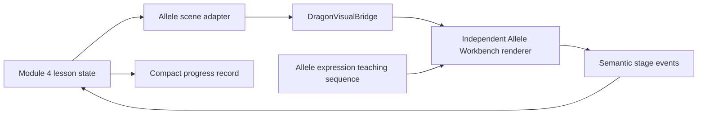

# 04 - Allele Workbench

**Status:** Implemented · **Curriculum:** Module 4, Dominant / Recessive Trait Rule Lab ·
**Skill:** GEN-4 · **Contract:** `allele-switchboard`

## Teaching purpose

Students change one allele, construct `DD`, `Dd`, and `dd` combinations, predict the phenotype,
and use the instrument trace to infer the expression rule. The simulation makes two ideas visible:

1. `DD` and `Dd` can produce the same dominant phenotype while remaining different genotypes.
2. The recessive allele remains present in `Dd`; it is not erased when it is not expressed.

The station uses the four classroom genes `W/w`, `F/f`, `S/s`, and `H/h`. Allele symbols and
phenotype labels come from scene data rather than being baked into the drawing.

## Implemented experience

The supplied [`allelle-diagram.html`](../allelle-diagram.html) established the visual language:
paired chromosomes, aligned gene loci, always-visible allele copies, and the three genotype
classes. The production station adapts that diagram into a compact scientific workbench:

- two SVG chromosome rods with four aligned gene bands;
- an illuminated focus locus for the selected gene;
- two accessible allele sockets over the focus locus;
- dominant and recessive token controls generated from lesson data;
- a prediction shield followed by a declarative expression trace;
- a phenotype-only scientific readout, with no dragon anatomy;
- a carrier-state indicator that explicitly preserves the recessive allele; and
- a three-class reference rail for homozygous dominant, heterozygous, and homozygous recessive.

## Student sequence

1. **Observe:** select a generic genome extract and compare the starting pair with the assigned pair.
2. **Build:** select or drag allele tokens into the two chromosome sockets. The assignment changes
   one allele so the student can see what changed.
3. **Predict:** lock either the dominant or recessive phenotype before any result is shown.
4. **Trace:** run the expression analyzer. The pair remains visible while the trace reaches the
   scientific phenotype readout.
5. **Explain:** pin the rule evidence that most directly supports the result.
6. **Save:** store a compact record and move to the next gene.

The build step precedes the prediction because the constructed genotype is the evidence the student
must reason from. The answer-bearing phenotype remains shielded until the prediction is locked.

## Four Module 4 records

| Task | Starting pair | Assigned pair | Expected expression | Primary evidence |
| --- | --- | --- | --- | --- |
| Wings | `ww` | `Ww` | Dominant: Winged | At least one dominant allele is present |
| Fire breathing | `Ff` | `ff` | Recessive: Does not breathe fire | Two recessive alleles are required |
| Horns | `Hh` | `HH` | Dominant: Horned | At least one dominant allele is present |
| Scale pattern | `ss` | `Ss` | Dominant: Spotted scales | The recessive allele remains present |

Module 4 does not complete from a multiple-choice answer alone. Every task must have a saved record
with the assigned pair, correct prediction, completed expression trace, and correct rule evidence.

## Architecture and ownership

The lesson owns genotype construction checks, phenotype expression, carrier state, evidence
correctness, progression, mastery, and Firestore-ready persistence. The renderer owns SVG drawing,
local token selection, drag state, animation playback, responsive layout, and reduced motion.

### Renderer files

| Path | Responsibility |
| --- | --- |
| `src/app/shared/dragon-visuals/displays/allele-switchboard/allele-switchboard-display.component.*` | Instrument UI, SVG chromosome pair, controls, animation state, accessibility |
| `src/app/shared/dragon-visuals/displays/allele-switchboard/allele-switchboard.view-model.ts` | Pure scene-to-view mapping and screen-reader summary |
| `src/app/shared/dragon-visuals/displays/allele-switchboard/allele-switchboard.theme.ts` | Replaceable palette, timing, and stable semantic targets |
| `src/app/features/dragon-genetics/stations/allele-workbench-station.component.*` | Module flow, domain decisions, feedback, and saved evidence |
| `src/app/features/dragon-genetics/simulation/data/allele-workbench-content.ts` | Four tasks, evidence rules, captions, and reteach wording |
| `src/app/features/dragon-genetics/simulation/domain/allele-workbench.models.ts` | Assessment record and misconception types |

## Scene contract

The `allele-switchboard` payload includes:

- selected `sampleId`, `focusGeneId`, and `taskId`;
- data-driven dominant and recessive allele symbols;
- starting, requested, and working allele pairs;
- dominant and recessive phenotype labels;
- the locked student prediction;
- lesson-derived actual phenotype, genotype class, and carrier state;
- reveal state; and
- evidence choices plus the pinned evidence ID.

The renderer does not call `showsDominantPhenotype`, inspect mastery rules, import the lesson store,
or write to Firebase.

## Semantic targets and events

Stable targets:

- `allele-token`
- `allele-slot-a`
- `allele-slot-b`
- `dominant-allele`
- `recessive-allele`
- `expression-path`
- `carrier-indicator`
- `phenotype-readout`

Events emitted by the renderer:

| Event | Meaning |
| --- | --- |
| `allele-selected` | A student chose a data-driven allele token |
| `allele-moved` | A token was placed into one of the two sockets |
| `prediction-locked` | A phenotype prediction was submitted before reveal |
| `reveal-requested` | The student energized the expression trace |
| `evidence-pinned` | A rule statement was chosen as evidence |
| `sequence-checkpoint-completed` | The prediction pause in the declarative animation resumed |

## Modes

| Mode | Behavior |
| --- | --- |
| Learn | Guided instructions, visible genotype reference, and immediate explanatory feedback |
| Practice | Four deterministic gene-change tasks with corrective feedback |
| Official | Placement, prediction, result, and evidence are recorded; immediate correctness language is hidden |
| Reteach | Repeats equivalent tasks while contrasting dominant with stronger, better, and more common |

## Saved evidence

Each `AlleleWorkbenchRecord` saves:

- scene ID, seed, sample, task, mode, trait, and focus gene;
- starting, requested, and final working pair;
- construction correctness and move count;
- prediction, actual expression result, and prediction correctness;
- genotype class and carrier state;
- selected rule evidence and evidence correctness;
- misconception flag, elapsed time, and timestamp.

The store keeps one current record per task and mode, mirrors the prediction into the existing
Module 4 answer map, and requires all four supported records before awarding GEN-4 completion.

## Accessibility and responsive behavior

- Dragging has a full keyboard alternative: select a token, then select a socket.
- Native buttons preserve focus behavior and DOM reading order follows the teaching flow.
- Dominant/recessive meaning is paired with symbols and text, never color alone.
- A live screen-reader summary reports the pair, prediction, reveal state, and the fact that both
  alleles remain visible.
- `prefers-reduced-motion` collapses transitions without changing the revealed evidence.
- At narrow widths the chromosome and expression consoles stack without horizontal scrolling.

## Acceptance checks

- [x] Both allele tokens remain visible after every reveal.
- [x] `Dd` and `DD` can share a phenotype while retaining distinct genotype labels.
- [x] Allele symbols and phenotype labels are data-driven.
- [x] Result correctness remains lesson-owned.
- [x] Prediction is required before the answer-bearing trace.
- [x] Drag and select-then-place interactions produce the same semantic event.
- [x] Learn, Practice, Official, and Reteach interaction paths are covered by component tests.
- [x] The view-model has tests for visible heterozygous state and pre-reveal shielding.
- [x] The scene adapter and contract validator accept valid workbench state.

## Visual replacement guide

An illustrator may replace the SVG rod shapes, band styling, palette, and motion timing without
changing lesson code. Preserve the scene contract, semantic target IDs, two visible socket controls,
DOM reading order, and phenotype-only readout. Do not add embedded answer logic or dragon anatomy to
the renderer.
