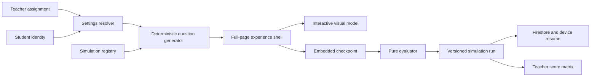

# Adaptive full-page simulation architecture

The Dragon Genetics student experience now uses one route per scientific instrument. The mission
map lives at `/dragon-genetics`; a simulation lives at `/dragon-genetics/:simulationId`. Simulation
routes hide the global application chrome and use the complete viewport for the model, embedded
question dock, and short phase rail.

## Runtime flow



## Source map

| Concern | Source |
| --- | --- |
| Simulation, level, assignment, run, and response contracts | `src/app/features/dragon-genetics/adaptive/dragon-simulation.models.ts` |
| Ten core simulations, Hatchery, Arena, and the Grade 7 through AP challenge bank | `adaptive/dragon-simulation.registry.ts` |
| Seeded selection, option order, and pure evaluation | `adaptive/dragon-question.generator.ts` |
| Assignment and simulation-run Firestore access | `adaptive/dragon-adaptive.repository.ts` |
| Resolution, resume, response, completion, and device fallback | `adaptive/dragon-adaptive.store.ts` |
| Full-screen route and embedded question controller | `adaptive/dragon-simulation-experience.page.*` |
| Data-driven visual instrument surface | `adaptive/dragon-simulation-visual.component.*` |
| Mission map | `dragon-genetics.page.*` |
| Assignment and student overrides | `dragon-teacher.page.*` |

## Level resolution

The effective level is resolved in this order:

1. teacher preview level, when present;
2. student override for the current simulation;
3. student default level;
4. simulation assignment setting; and
5. assignment default.

Changing an assignment increments `assignmentVersion`. An in-progress run retains its saved level,
seed, and question IDs. A completed run receives a new equivalent set when its assignment version or
level changes.

The current level profiles are `grade-7`, `grade-8`, `high-school`, and `ap-biology`. Higher levels
include their target-level challenge plus a deterministic mix of prerequisite and evidence
questions. AP prompts explicitly test model assumptions and statistical or population reasoning;
they do not merely substitute harder vocabulary.

## Persistence

```text
dragonGeneticsAssignments/{assignmentId}

dragonLabProgress/{studentId}
  summary fields used by the teacher dashboard

dragonLabProgress/{studentId}/simulationRuns/{simulationId}
  level, assignment version, content version, seed, question IDs,
  compact responses, misconception flags, score, and completion
```

Device fallback keys are namespaced by authenticated student ID. The legacy mission snapshot is
migrated to schema version 4 and remains readable so previous evidence is not discarded.

## Generation rules

- A seed contains student ID, assignment ID, simulation ID, and assignment version.
- The same seed and content version reconstruct the same question and option order.
- Official correctness remains in pure TypeScript evaluators, never in SVG or visual components.
- Every generated run contains a question authored for its resolved instructional level.
- Question counts are constrained to one through six.
- Runtime generative AI is not used for graded items. New templates require review, tests, and a
  content-version increment before release.

## Accessibility and responsive behavior

- Visual nodes and answer choices are native buttons.
- Every visual target exposes a label, detail, selected state, and non-color symbol.
- Feedback and active instrument records use polite status regions.
- The layout changes from side-by-side stage and dock to a stage plus bottom sheet on narrow screens.
- Essential copy remains HTML and supports wrapping and zoom.
- `prefers-reduced-motion` disables scan animation and movement transitions.
- The interaction is complete without dragging or pointer precision.

## Release gates

Run `npm run verify` before deployment. Adaptive generation tests cover all ten simulations at all
four levels, fixed-seed reconstruction, variant generation, answer validity, and evaluator behavior.
Firestore tests cover assignment ownership, student run ownership, assigned-teacher reads, and
rejection of unrelated student or teacher reads.

Before adding a new content version, complete a science review of every new template and manually
inspect desktop, Chromebook, tablet, narrow/mobile, keyboard-only, screen-reader, and reduced-motion
paths. Record difficulty calibration results separately from correctness so level changes do not
masquerade as changes in mastery.
