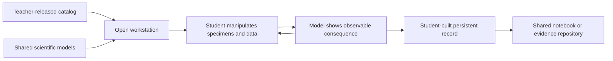

# Workstation build standard

Use this engineering standard with the authoritative
[Dragon Genetics workstation product rules](../DRAGON_GENETICS_WORKSTATION_RULES.md). The product
rules define the experience; this document defines how to implement it safely.

## Required design brief

Before writing code, add these decisions to the workstation's guide:

| Decision               | Required answer                                                                 |
| ---------------------- | ------------------------------------------------------------------------------- |
| Scientific goal        | The relationship students should understand through investigation               |
| Manipulable evidence   | The specimens, samples, genes, chromosomes, tools, or data students can operate |
| Observable consequence | What visibly changes because of a student's action                              |
| Student-built record   | The chart, claim, comparison, notebook entry, or evidence set that persists     |
| Shared sources         | Existing catalogs, renderers, and repositories that provide scientific truth    |

Do not start implementation when the proposal describes only a prompt, answer choices, and
feedback. That is an assessment screen, not a workstation.

## Interaction architecture



The workstation is an open state space. Students may move among valid tools and specimens without a
phase controller. Scientific prerequisites may control a result, but a lesson script must not
control the order of unrelated actions.

## Dedicated workstation shell

A dedicated workstation route contains:

- a concise scientific goal;
- the complete interactive laboratory surface;
- compact current-state or measurement readouts;
- optional Guide or Hints access that is closed by default; and
- persistent notebook or record access when relevant.

It does not contain:

- an embedded question dock;
- multiple-choice answer buttons;
- a numbered phase rail;
- Observe / Predict / Manipulate / Reveal / Explain steps;
- a required `Continue` button;
- a score panel attached to the instrument; or
- directions occupying the main scientific surface.

Registry-generated questions may continue to support temporary generic simulations or a separate
assessment experience. They are not mounted beside a dedicated workstation.

## Direct-manipulation contract

- Use drag-and-drop when the student is spatially moving a scientific object.
- Provide select-object, then select-destination as an equivalent native-button path.
- Both paths call the same state transition and create the same evidence.
- Keep the source element stable during drag; use a bounded drag preview.
- Do not let dragging resize a panel, move sliders, or produce layout flashes.
- Permit repeated experiments and replacement of loaded samples.
- Preserve valid state when panels restack at narrow widths.

## Scientific-data boundary

A workstation component consumes data; it does not create a private version of scientific truth.

- Teacher settings own record availability.
- The shared chromosome catalog owns length, centromere, band, color, and locus geometry.
- The shared gene and DNA catalogs own gene identity and allele sequences.
- Expressive-genome and assembly code own rendered dragon phenotype.
- The shared notebook or explicit evidence repository owns cross-workstation student records.
- The repository boundary owns mock-device persistence versus future database persistence.

One source change must propagate to every workstation that represents the same object.

## Visual implementation

- Use code-driven Angular and SVG for scientific models that must change with data.
- Clip, label, and position SVG structures from normalized input data when possible.
- Use the existing assembly renderer for a phenotype dragon; do not generate substitute artwork.
- Do not include a dragon if the investigation does not use phenotype as evidence.
- Treat reference images as visual/scientific references, not runtime assets, when the model must be
  interactive.
- Give every SVG, canvas, and assembled specimen an accessible name or summary.
- Pair color with a stable label, sample code, pattern, shape, or line style.

## Answer concealment

Unknown values must remain unknown until student investigation supports them.

- Use neutral sample IDs instead of answer-bearing allele notation.
- Use neutral chromosome placeholders before a sample is loaded.
- Do not pre-label dominant, recessive, genotype, trait, or phenotype answers.
- Do not put concealed answer text in visually hidden DOM content.
- Reveal only the evidence produced by the tool used. Seeing a phenotype does not reveal an
  unperformed genotype test.

## Persistence and mock mode

Every dedicated workstation must run without a live database during local development.

- Load teacher-released mock data through the same repository-facing contract used by the host.
- Save student experiments and discoveries locally under the current student identity.
- Restore relevant records after refresh and when opening another workstation.
- Keep repository replacement separate from workstation interaction state.
- Never place temporary mock answers directly in component templates.

## Component location

Create feature-specific code under:

```text
src/app/features/dragon-genetics/workstations/<workstation-name>/
```

Keep component, template, styles, view model, focused content, record types, and tests together.
Place only genuinely cross-workstation catalogs, notebook models, and visual components in
`workstations/shared/`. Generic application infrastructure remains under `src/app/shared/`.

## Accessibility and responsive behavior

- All tools and movable records are reachable by keyboard.
- Click/select alternatives do not require pointer precision.
- Focus order follows the physical laboratory layout.
- Accessible summaries report the current model state without leaking concealed answers.
- Reduced-motion mode shows identical scientific results without spatial animation.
- Panels stack without losing selection, loaded specimens, or experiment history.
- Text remains readable on Chromebooks, tablets, and projected classroom displays.

## Completion gate

A dedicated workstation is ready only when:

- it presents one scientific goal and no scripted procedure on the main surface;
- it has no question dock, phase rail, or required next-step control;
- students can freely select and repeat valid experiments;
- drag operations have a matching click/keyboard path;
- observable results derive from the loaded scientific data;
- hidden answers do not leak before the appropriate investigation;
- relevant student-built records persist across reloads and workstations;
- mock mode works without a live database;
- narrow and reduced-motion layouts retain the full investigation; and
- focused tests cover data mapping, concealment, both interaction paths, persistence, and repeated
  experiments.
