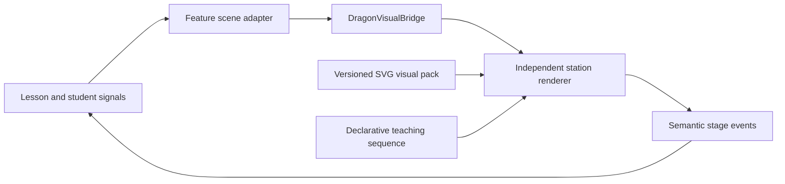

# Simulation build standard

Use this standard for every Dragon Genetics laboratory display.

## Architecture

The lesson owns correctness, progression, student responses, and evidence. The renderer owns only
short-lived presentation state such as focus depth, animation progress, selected marks, and reduced
motion. SVG assets contain no curriculum sentences or answer logic.

## Required teaching loop

Every important concept uses the same sequence:

1. **Observe:** show the selected sample record and relevant scientific model.
2. **Predict:** require a classification or prediction before revealing the answer.
3. **Manipulate:** make the student operate the model, not merely press Next.
4. **Reveal:** animate the scientific relationship and show the result.
5. **Explain:** require the student to select evidence supporting a claim.
6. **Save:** emit a compact event that the lesson converts into assessment evidence.

## Display boundary

- Read the current `DragonVisualScene` from `DragonVisualBridge.scene`.
- Render only when `scene.kind` matches the station's instrument kind.
- Resolve samples using IDs from the discriminated `scene.instrument` payload.
- Never import lesson stores, Firestore, routers, mastery rules, or genetics feature components.
- Never render dragon anatomy inside an instrument. Use phenotype text or symbols as readouts.
- Never calculate official correctness in the renderer.
- Emit only `DragonVisualStageEvent` values through the bridge.

## SVG authoring contract

Each station SVG should be a replaceable asset in a versioned visual pack. Use stable semantic IDs
instead of code that depends on path order or pixel coordinates.

Required conventions:

- one root ID matching the station, such as `genome-microscope`;
- named groups for all animation and interaction targets;
- named anchors for token destinations and motion paths;
- text placeholders, not baked-in lesson wording;
- a logical `viewBox` that remains readable at Chromebook and tablet widths;
- meaningful reading order even when animation is disabled; and
- no scripts, external URLs, embedded assessment answers, or student data in the SVG.

Use these common semantic targets where relevant: `sample-record`, `prediction-control`,
`reveal-control`, `evidence-mark`, `phenotype-readout`, `allele-slot-a`, `allele-slot-b`,
`parent-a-alleles`, `parent-b-alleles`, and `offspring-allele-slots`.

## Modes

| Mode | Guidance | Reveal | Evidence |
| --- | --- | --- | --- |
| Learn | Labels, narrated cues, and one worked example | Pauses for prediction, then explains | Guided evidence selection |
| Practice | Fewer labels, varied deterministic sample | Only after submitted prediction | Corrective feedback and misconception flag |
| Official | No hints and equivalent randomized conditions | Locked until answer submission | Attempts, response, result, selected evidence |
| Reteach | Isolates the diagnosed misconception | Stepwise comparison | Correction plus a new equivalent example |

## Instructional levels and generated sections

Mode describes support and assessment conditions; instructional level describes the scientific
reasoning expected. They are independent. Every full-page simulation resolves `grade-7`, `grade-8`,
`high-school`, or `ap-biology` from its assignment before generating a run. A higher level changes
the evidence, number of reasoning steps, statistical expectations, and model limitations—not only
the reading level.

Generated runs must be deterministic from student, assignment, simulation, version, and attempt
inputs. Store the seed and template IDs rather than duplicated prompt text. An in-progress run never
changes when the teacher publishes a new assignment version. Runtime-generated official questions
must use reviewed templates and pure evaluators; unreviewed generative-model output is not gradable
content.

## Accessibility and motion

- Give the simulation a concise accessible name and a live text summary of its current state.
- Pair color with a label, line style, symbol, or shape; parent origin cannot rely on color alone.
- Support keyboard operation with select-then-place as an alternative to dragging.
- Keep focus order aligned with Observe, Predict, Manipulate, Reveal, Explain.
- Honor `prefers-reduced-motion`; reveal the same state without spatial animation.
- Prevent looping decoration while students read or answer.
- Keep essential text in HTML when practical so it can wrap and localize.

## Evidence event minimum

For a meaningful checkpoint, the lesson should be able to save the scene ID, deterministic seed,
sample IDs, focus gene, pre-reveal prediction, required action, revealed result, selected evidence,
attempt count, misconception flag, and elapsed active time. Do not save animation frames, pointer
tracks, SVG markup, or screenshots.

## Implementation shape

Create each renderer under `src/app/shared/dragon-visuals/displays/<station-name>/`. A station may
contain an Angular component, a pure view-model mapper, SVG binding helpers, and focused tests. Keep
shared playback and SVG-loading utilities beside the station folders rather than duplicating them.

## Completion gate

A station is ready only when it:

- supports Learn, Practice, Official, and targeted Reteach scenes;
- requires a prediction before every answer-bearing reveal;
- renders fixed-seed examples without lesson or Firebase services;
- validates all sample and semantic target references;
- works with keyboard input, reduced motion, and narrow layouts;
- produces a screen-reader summary matching the visible state;
- emits the required semantic evidence events; and
- has unit tests for view-model mapping and one interaction-path test per mode.
